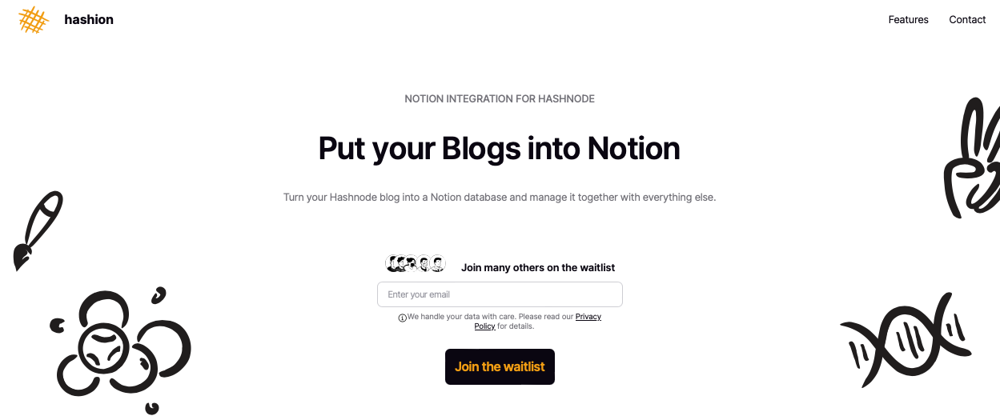

# Next.js + EmailOctopus wait list page



## Description:

A wait list page to capture potential customer emails using EmailOctopus
service.

- Designed using Figma
- Built using powerful technologies: Next.js, Typescript and Tailwind CSS.
- Mobile responsive

# Run

Start development server on default port `3000`:

```shell
pnpm run dev
```

# Production

We use Docker to ship the application. 

## Build docker image

To build the image using `Dockerfile` in the folder, run:

```shell
docker build -t hashion-waitlist .
```

## Run docker image

Make sure you have Docker deamon running (I use limactl with docker inside) and run:

```shell
docker run -p 3000:3000 hashion-waitlist
```

Access the application on `http:localhost:3000`.
